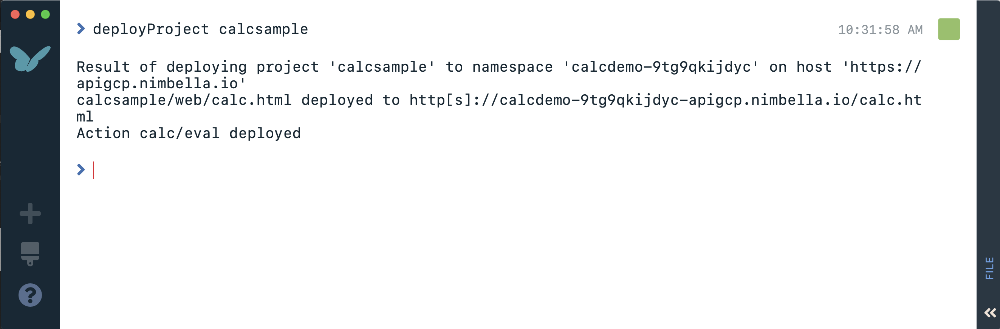
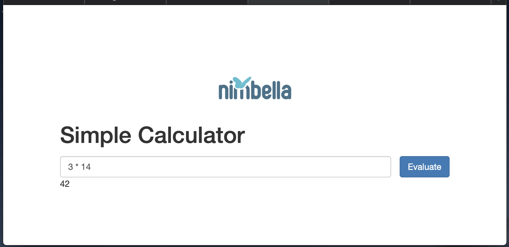

# Adding a Function (Calculator 2)
- Next we will deploy a function the has the calculator logic.  All function code files reside in the `packages` direcotry.  In addition, we must choose a particular package folder.  Here we'll pick `calc` as the folder name and place the code in `calc.js`.  The code is very short as we will (unsafely) use nodejs's *eval* to perform the computation.  Run the following commands and use the workbench editor to sae the code below.

```
mkdir -p calcsample/packages/calc
touch calcsample/packages/calc/eval.js
editor edit calcsample/packages/calc/eval.js
```

```
function main(args) {
    let expr = args['text']
    let result = eval(expr)
    return { 'result': result }
}

exports.main = main
```

- Without modifying the project configuration file (we'll explain why), deploy the project again with `project deploy`.  Note that the output indicates that the action has also been deployed now.




- Try out the webpage again and this time the calculator button will trigger a computation remotely and display the result.




