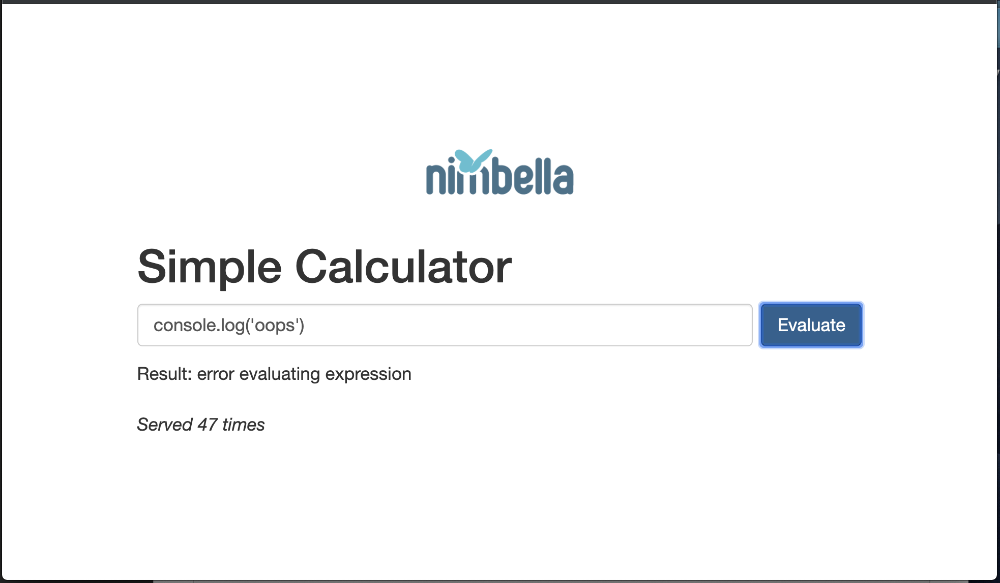

# Adding Packages (Calculator 4)
- The use of `eval` is unsafe as it will allow arbitrary code to be written whereas we only want to evaluate numerical expression.  We'll replace `eval` with the npm package `expression-eval`.  To use packages at all, we'll need to restructure our function directory a bit by moving the `eval.js` file into its own directory with a `package.json` file.

```
mkdir ~/calcsample/packages/calc/eval
mv eval.js ~/calcsample/packages/calc/eval/
touch ~/calcsample/packages/calc/eval/package.json
```

- Fill out the empty file `package.json` with

```
{
  "name": "calc",
  "version": "1.0.0",
  "description": "Serverless caculator demo",
  "main": "eval.js",
  "dependencies": {
    "expression-eval": "^2.0.0"
  },
  "devDependencies": {}
}
```

- At this point, the function is set up to be able to use the package but is not doing so yet.  Add `const expr = require('expression-eval')` to the beginning of the file.  Replace the call to nodejs's `eval` to this newly defined function:

```
function evaluate(exprStr) {
    try {
        let ast = expeval.parse(exprStr)
        return expeval.eval(ast)
    } catch {
	return "error evaluating expression"
    }
}
```

- The updated `eval.js` should look like this:

```
const expeval = require('expression-eval')
const nim = require('nim')
const key = 'counter'

function main(args) {
    let expr = args['text']
    let result = evaluate(expr)
    let redis = nim.redis()
    return redis.getAsync(key)
      .then(reply => { return updateAndReply(redis, asCount(reply), result) })
      .catch(err =>  { return updateAndReply(redis, 0, result) } )
}

function evaluate(exprStr) {
    try {
        let ast = expeval.parse(exprStr)
        return expeval.eval(ast)
    } catch {
	return "error evaluating expression"
    }
}
function asCount(s) {
    if (Number.isInteger(s)) { return s }
    let v = parseInt(s, 10)
    return isNaN(v) ? 0 : v
}

function updateAndReply(redis, count, text) {
    return redis.setAsync(key, count+1)
      .then(reply => { return { count: count, result: text } })
      .catch(err =>  { return { count: count, result: text } })
}

exports.main = main
```

- Attempting to evaluate a non-numeric expression will now be detected and caught.

