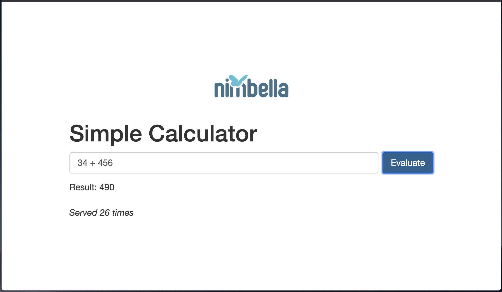

# Adding State (Calculator 3)
- Next we will add a counter to the calculator to show how many times it has been run.  Update `calc.html` and replace the function `update` with 

```
function update(jsonResult) {
    let result = jsonResult['result']
    let count = jsonResult['count']
    $("#myresult").html('Result: ' + result + '<br><br><i>Served ' + count + ' times</i>')
}

```

- In Nimbella, every namespace comes with a redis instance that is configured to be accessible by every function deployed in that namespace.  At the beginning of the code add the line `let nim = require('nim')` to create a global Nimbella instance and create a bound redis object in the main function with `let redis = nim.redis()`.  In the case of `eval.js`, update the code to the following:

```
let nim = require('nim')
let key = 'counter'

function main(args) {
    let expr = args['text']
    let result = eval(expr)
    let redis = nim.redis()
    return redis.getAsync(key)
      .then(reply => { return updateAndReply(redis, asCount(reply), result) })
      .catch(err =>  { return updateAndReply(redis, 0, result) } )
}

function asCount(s) {
    if (Number.isInteger(s)) { return s }
    let v = parseInt(s, 10)
    return isNaN(v) ? 0 : v
}

function updateAndReply(redis, count, text) {
    return redis.setAsync(key, count+1)
      .then(reply => { return { count: count, result: text } })
      .catch(err =>  { return { count: count, result: text } })
}

exports.main = main
```

- Once the project has been redeployed with `project deploy`, the web page will look like


