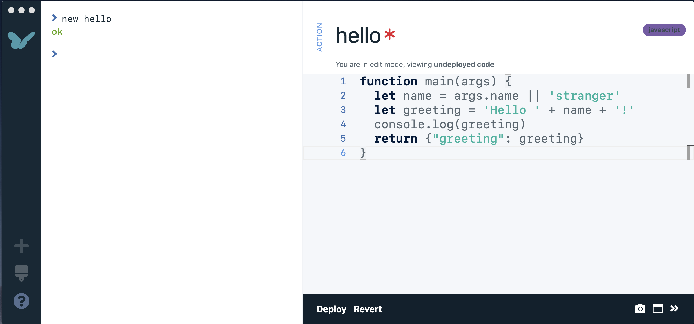
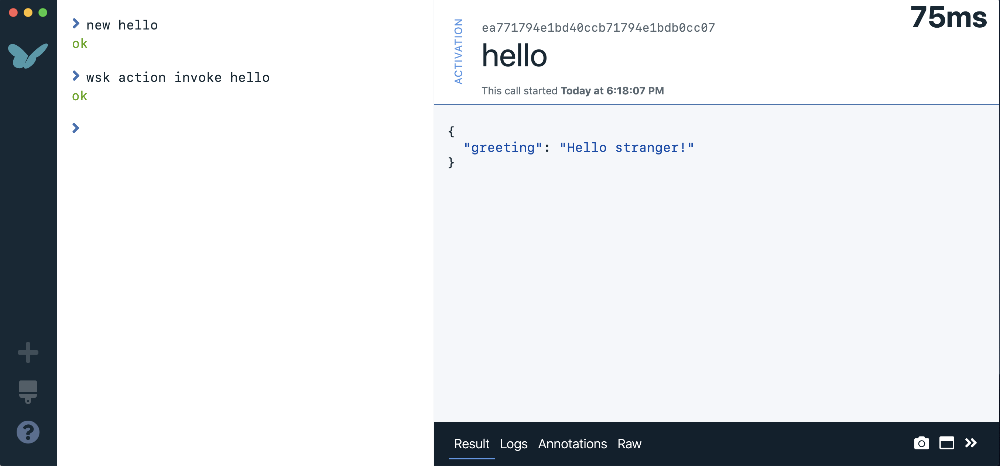
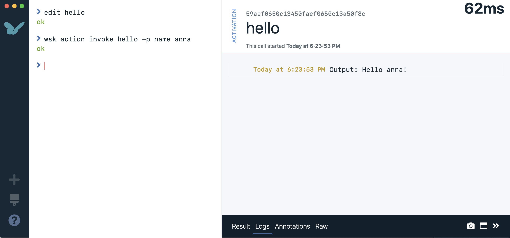

# Getting Started
- Make sure you've followed the steps in **Setting Up** to have a ready to go Workbench.  In the set up phase, we ran `wsk action list` to list all the serverless actions that are under the current account.  Because this is a fresh account, no actions are listed.  Let's create a new nodejs action by running `new hello`.  A sidecar containing a nodejs action will pop up to the right.  By default, the supplied code is a simple hello world action.

- Click the `Deploy` button in the bar beneath the editor portion to send the code to the Nimbella cloud and notice that the status message above the code is updated and the red asterik indicating unsaved changes is now absent.  Click in the shell portion (the left half the screen) and type `wsk action invoke hello`.  This command runs an action in the cloud and will also retrieve and display the result in the sidecar.  We call each run of an action an *activation* which is associated with a globally unique alphanumeric identifier called an *activation ID*.

- Next, let's edit the action and run it again with parameters this time.  Run `edit hello` in the shell to being the code editor back.  On line 3, change the string ``Hello `` to ``Hey ``.  On line 4, change `console.log(greeting)` to `console.log('Output:', greeting)`.  Then redeploy the action by clicking the `Deploy` button.  Back in the shell, run `wsk action invoke hello -p name anna`.   This will run the action while passing with the parameter `name` bound to the value `anna`.  As expected, the output now includes the code change and incoming parameter so it says `Hey anna!`.  Click the `Logs` tab at the bottom to see the console output.

- Although the action has been deployed, access is so far guarded by the credentials.  We can make this action publicly visible by using the running the command `webbify hello`.  The action is now accessible via the display URL.  Copy this URL into a browser (on another computer if desired) to test it.  You can also add the query parameter `?name=peter` to the end of the URL.