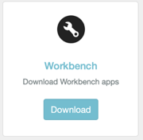
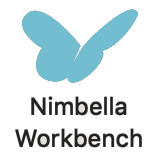
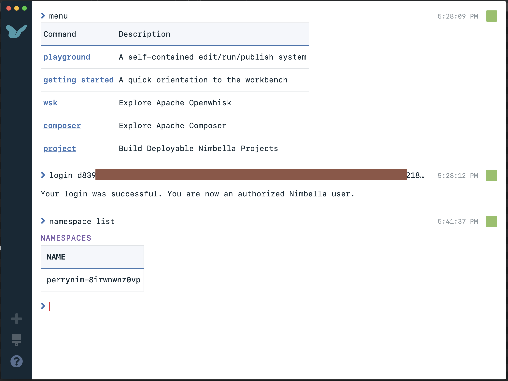

# Setting Up (Workbench)
- If you are running on a Mac, download the Nimbella Workbench by going to the Nimbella landing page [here](https://nimgcp.nimbella.io/content/landing/index.html).  Download the Mac disk image by clicking the Download button.  Open the disk image and install the app.   We will be releasing the Windows and Linux versions soon.

- After requesting access to Nimbella [here](https://tender-darwin-834905.netlify.com/request/), you will receive an email with your credentials.  For the workbench, you'll need the login token which is a single long string that the workbench can authenticate with.

- Launch Nimbella Workbench.  Depending on your security settings, the initial launch may require that you Control-click the app icon .  Run the command `login <login-token>` to authenticate.  To confirm that things are ok, run `namespace list` to show your namespace.

