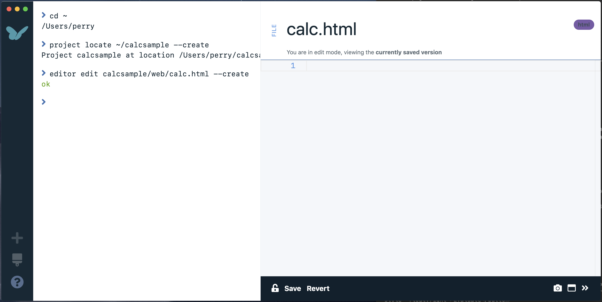
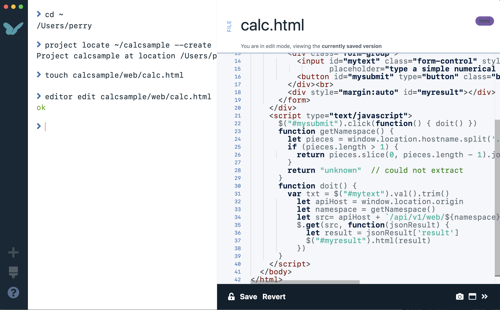
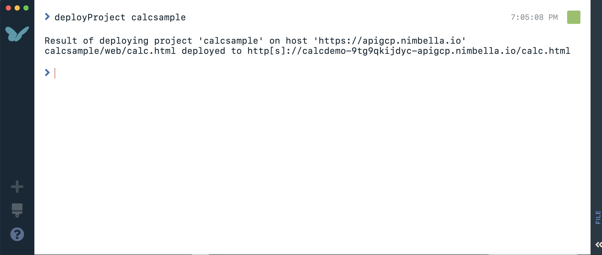
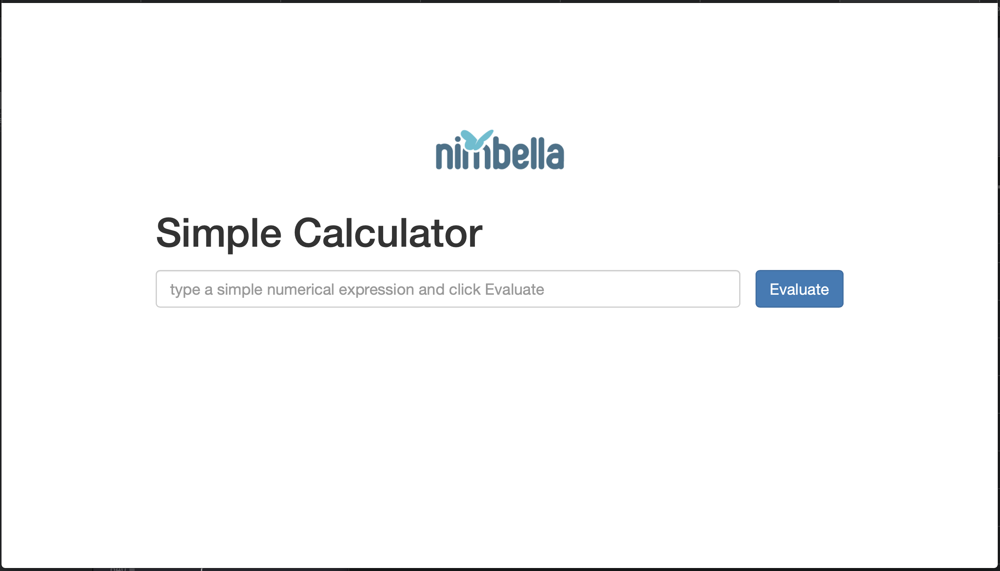

# Deploying Static Assets (Calculator 1)
- For serverless applications that require multiple actions or static assets such as html, we use Nimbella's **deployer** tool. As an example, we will develop a calculator website consisting of an html page and a backing action that performs the evaluation.  Start by running these commands in the workbench to create a project in your home directory.

```
cd ~
project locate ~/calcsample --create
```

- The project just created has a `web` folder for holding static assets including html.  Create the file and enter the editor with:

```
editor edit calcsample/web/calc.html --create
```



- Paste the following content into the editor window and hit the **Save** button.  Because the workbench deployer runs directly off the filesystem, an external editor can also be used instead.

```
<!DOCTYPE html>
<html lang="en">
  <head>
    <title>Your Serverless Cloud Example. Beautiful.</title>
    <link rel="stylesheet" href="https://maxcdn.bootstrapcdn.com/bootstrap/3.3.7/css/bootstrap.min.css">
    <script src="https://ajax.googleapis.com/ajax/libs/jquery/3.1.1/jquery.min.js"></script>
  </head>
  <body style="padding-top:100px">
    <div class="container" style="width:600px">
      <center></center>
      <h1>Simple Calculator</h1>
      <div class="form-group" style="height:30px">
        <form id="myform" onsubmit="generate(); return false">
          <input id="mytext" class="form-control" style="float:left;width:85%;" type="text" name="text" maxlength="128"
                 placeholder="type a simple numerical expression and click Evaluate" value=""/>
          <button id="mysubmit" type="button" class="btn btn-primary" style="float:right">Evaluate</button>
        </form>
      </div>
      <div style="container" style="width:600px" id="myresult"></div>
    </div>
    <script type="text/javascript">
      $("#mysubmit").click(function() { doit() })
      // Obtain	user namespace from
      function getNamespace() {
        let pieces = window.location.hostname.split('.')[0].split('-')
        return pieces.slice(0, Math.max(1, pieces.length - 1)).join('-')
      }
      function doit() {
	var txt = $("#mytext").val().trim()
        let apiHost = window.location.origin
        let src = apiHost + '/api/calc/eval.json?text=' + encodeURIComponent(txt)
        $.get(src, function(jsonResult) { update(jsonResult) })
      }
      function update(jsonResult) {
        $("#myresult").html(jsonResult['result'])
      }
    </script>
  </body>
</html>
```



- Next we will add a project configuration file to indicate the page we just created is the main page for the project.  Create the project configuration file `projectConfig.yml` with the content below.

```
touch calcsample/projectConfig.yml
editor edit calcsample/projectConfig.yml
```

```
bucket:
  mainPageSuffix: calc.html
```

- Now we are ready to deploy our project by running `project deploy`.



- Try out the website by navigating to the URL displayed in your deployment.  If you try to use the calculator though, nothing happens because we have not deployed the backing function yet.  We'll do that next.



